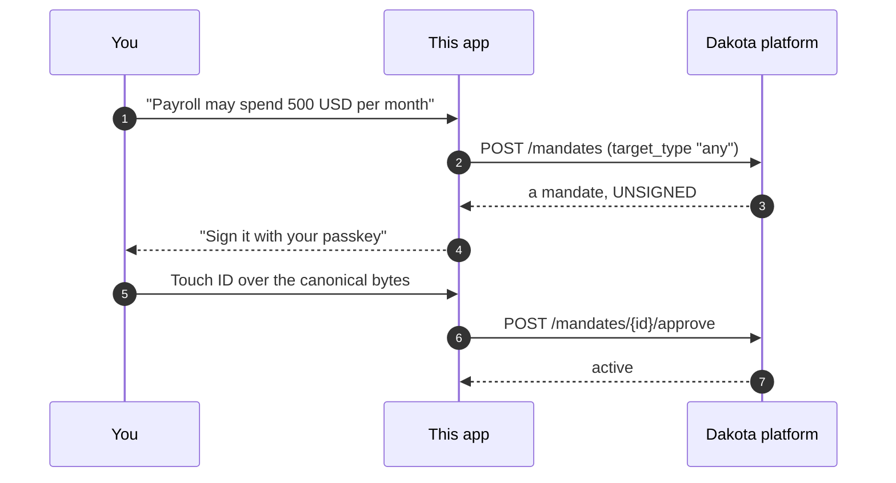
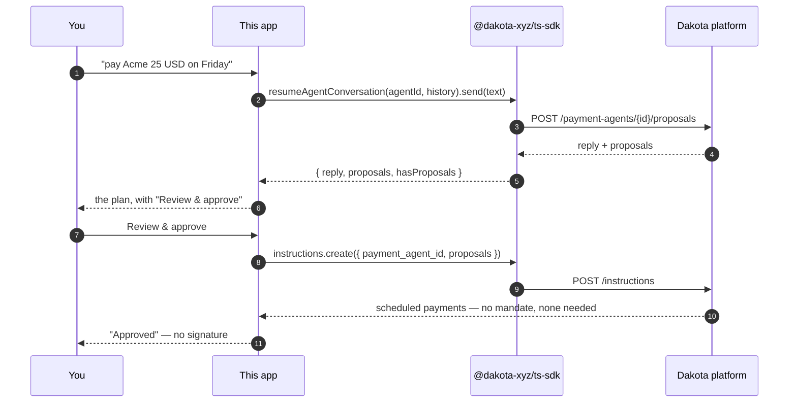
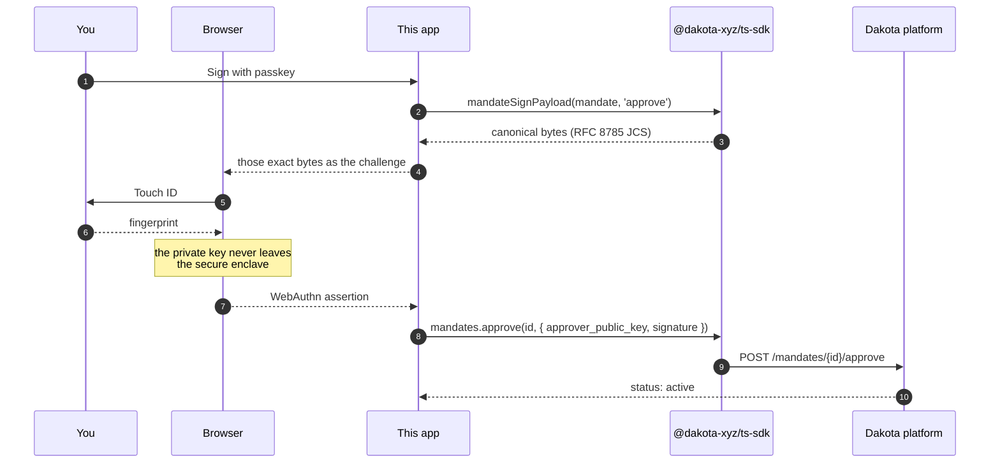
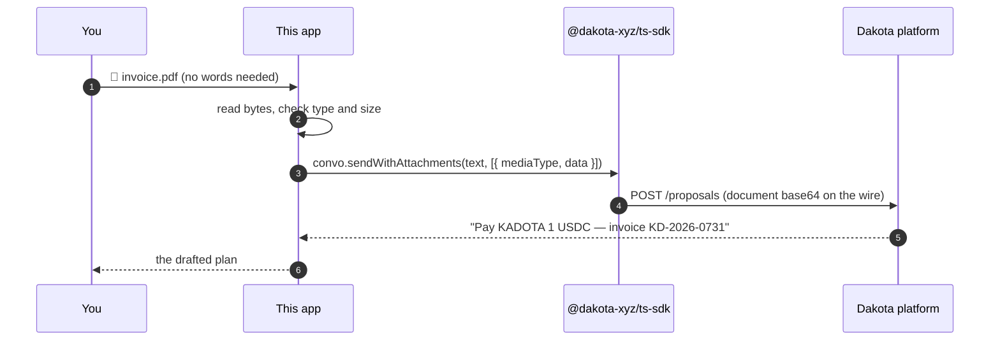
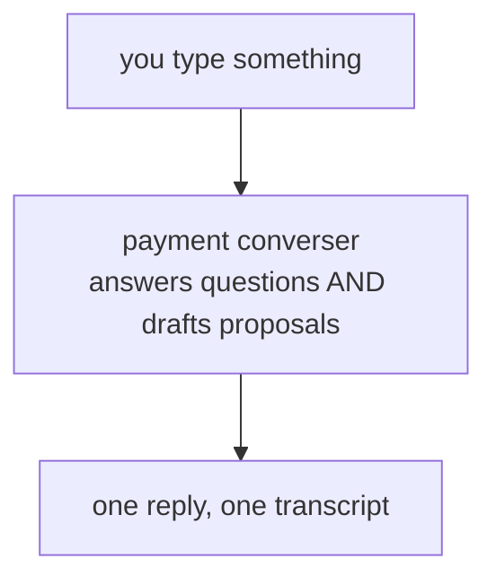
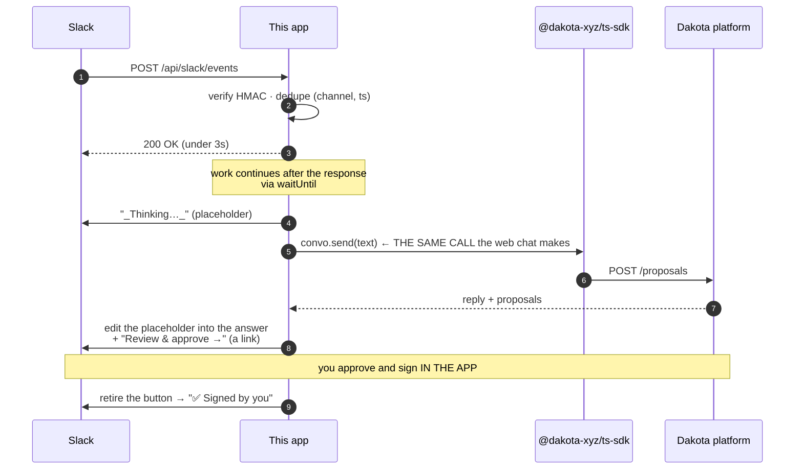
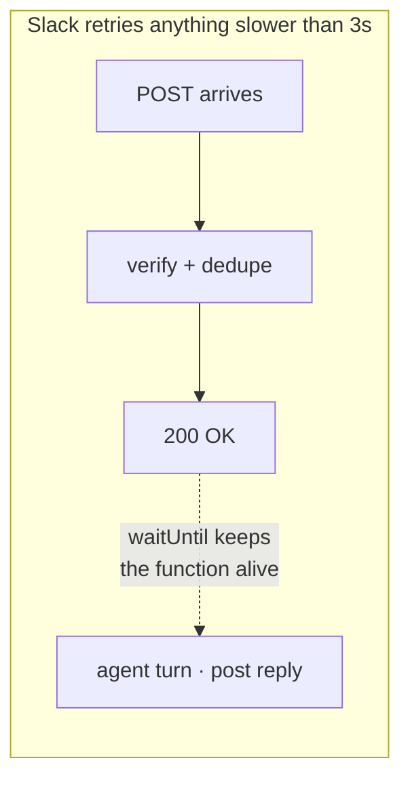
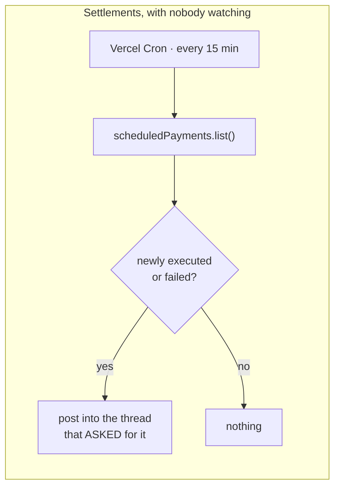
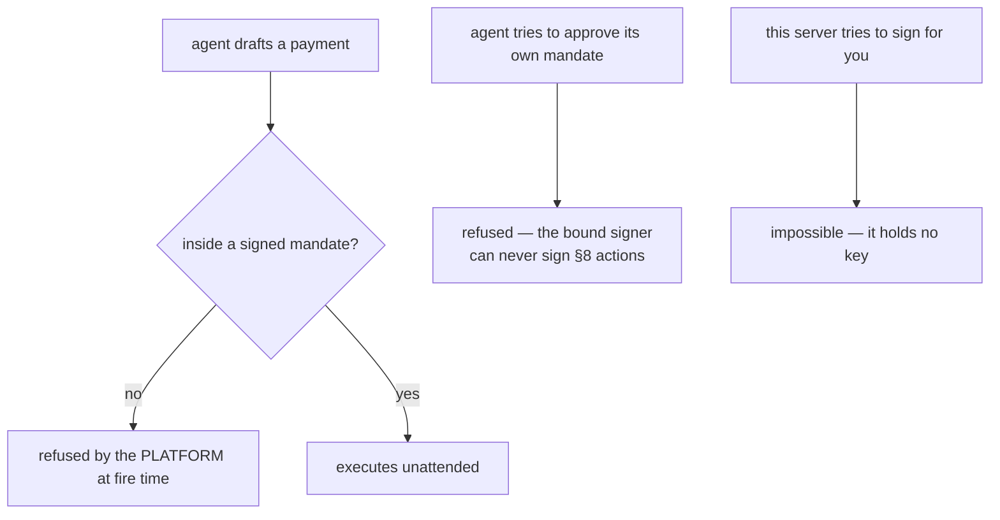

# How it works

Every flow in this demo, end to end, with the SDK call that does the work.

The point of reading this is the ratio: **there is almost no application logic
here.** The agent's reasoning, the canonical signing bytes, the schedule
enforcement — all of that is the platform. What is left is transport: take a
message from somewhere, hand it to the SDK, put the answer back.

That is what makes hooking up something like Slack a small job rather than a
project.

---

## 1. Give the agent a limit — once

Authority is granted before anything is asked for, not alongside each request.
You decide how much this agent may ever spend, sign that with a passkey, and it
works inside it from then on.



That signature is the whole trust model, and it happens **once**. Everything
below spends inside it.

---

## 2. Ask for a payment

The core loop. Everything else is a variation on it.



**No signature here.** The plan carries no `create_mandate` action, because the
platform is told this client's agents may not draft their own authority:

```ts
await client.agenticPolicy.set({ mandate_strategy: 'external_only' })
```

Ask for more than the limit allows and the agent does not offer to widen it —
it replies pointing at the app, where a person sets limits. That is the
difference between a policy and an instruction, and it is enforced upstream
rather than by this app being polite.

**The conversation is stateless.** The platform keeps nothing between turns —
you hold the transcript and resend it. That is why this runs on serverless
functions that keep nothing either:

```ts
const convo = client.resumeAgentConversation(agentId, storedHistory, { timezone })
const turn = await convo.send(text)
await save(convo.messages())      // for the next turn
```

Approving is **not** authorizing. It says "yes, that is the payment I meant" —
the authority was granted in step 1, and `instructions.create` can only ever
produce payments that fit it. A payment beyond the limit is refused when it
fires, not quietly allowed because someone clicked.

---

## 3. Signing — the part no server can fake



**This server cannot authorize a payment on your behalf.** It builds the
challenge and forwards your assertion; it never holds a key that could sign one.
That is the property the whole demo rests on, and the reason a Slack button
*links into the app* instead of approving — there is no browser, no origin and
no secure enclave inside an HTTP callback.

Getting the bytes right is the one thing most likely to be got subtly wrong by
hand: they must be RFC 8785 canonical JSON, byte-identical to what the platform
re-derives. `mandateSignPayload` does it, which is most of why this repo uses
the SDK rather than raw HTTP.

---

## 3. Send an invoice instead of typing

Same call, one extra argument.



```ts
await convo.sendWithAttachments('Draft a payment from the attached document.', [
  { mediaType: 'application/pdf', data: bytes, filename: 'invoice.pdf' },
])
```

A document with no message is a complete request — it means *"pay this"*. The
agent reads the payee, amount, network and due date out of it. PDF, PNG, JPEG,
WebP and GIF; 8 MiB cap.

---

## 4. Ask about the account

Ask in the same box, in the same conversation. *"Pay MeatCo $2,000"* and
*"how much am I spending on MeatCo?"* are the same `send()`.



```ts
const turn = await client.resumeAgentConversation(agentId, history).send(text)
```

**This used to be two endpoints and a guess.** The app keyword-matched every
turn — action words like `pay`/`send`/`schedule` went to the payments agent,
question words like `summary`/`how much`/`balance` went to a separate read-only
insight chat. The split existed for a real safety reason: a reporter that
cannot propose cannot answer *"how much am I spending?"* with something to
approve.

The matcher was the weak part, not the idea. It read the words and nothing
else, so it defaulted to PAYMENTS on everything ambiguous — misrouting a
question is mild, while misrouting an INSTRUCTION to a reporter silently drops
a payment on the floor. A safe default is still a guess.

Platform folded account-insight Q&A into the converser (ENG-3407) and removed
the insight chat endpoint (ENG-3153). The decision now happens server-side with
the account actually in front of it, and the safety property is enforced where
it belongs: a turn that only answers a question comes back with no proposals,
so there is nothing to approve. You still see everything the agent proposes
before anything moves — that has not changed.

The deterministic insight REPORT is untouched: `client.insights.get(customerId)`
still backs the Insights panel. It was only the conversational half that moved.

---

## 5. Slack — the whole integration

This is the one worth studying if you are wondering what it costs to put an
agent somewhere new.



**Slack adds no payment logic.** It decides whether the message is even for the
bot, resolves which agent owns the channel, hands the text to the same
`convo.send()` the web composer uses, and posts the reply back. The whole
integration is:

| | |
|---|---|
| Verify the request really came from Slack | HMAC-SHA256 over `v0:{ts}:{body}` |
| Work out which agent owns the channel | a lookup in our own store |
| Ask the agent | `convo.send(text)` — unchanged |
| Post the answer | Markdown → Slack's *mrkdwn* |

That is the shape for **any** channel. Email, Telegram, Teams, a webhook from
your own ERP — each is "receive a message, call `send()`, post the reply."
The payment reasoning, the limits and the signing do not move.

### Which messages the bot answers

Because it subscribes to `message.channels`, Slack delivers **every** message in
a connected channel, not only the ones that name the bot. So the first thing the
route does is decide whether a message is the bot's business at all
(`src/lib/slack/gate.ts`). The one rule that ties it together: **if the bot
speaks in a thread, the bot listens in it** — for a ten-minute idle window, with
no need to be mentioned again. Talking keeps a thread alive; silence ends it.

| Message | Answered? |
|---|---|
| `@bot pay this` — a mention, anywhere | yes |
| A direct message to the bot | yes |
| A reply in a thread the bot has spoken in | yes — no re-mention needed |
| A plain channel message that did not mention the bot | no — colleagues talking |
| A reply in a thread the bot never joined | no — someone else's conversation |
| A thread reply that opens by naming someone else — `@Gabe …` | no — said *to* Gabe |
| A join, a leave, an edit, a pinned item (a message *subtype*) | no — not somebody talking |

The gate runs **before** the `(channel, ts)` deduper on purpose. An invoice
posted with a mention arrives twice — once as `app_mention`, once as a
`message` — on the same timestamp; letting an ignored delivery claim that slot
would drop the one the bot should answer. And only the **leading** bot mention
is stripped before the agent sees the text, so `pay @Alice 50` keeps `@Alice` as
content instead of losing the payee.

One consequence worth stating: an invoice dropped in the channel with **no
mention** is left alone. It has to be a mention, a DM, or a drop inside a thread
the bot is already following — otherwise every file anyone shares would be read
as "pay this."

### What Slack has to grant

Six scopes for a public channel, and each buys exactly one thing:

| Scope | Without it |
|---|---|
| `app_mentions:read` | the bot never hears you |
| `chat:write` | it hears you and cannot answer |
| `channels:history` | it cannot read the message it was mentioned in, or follow a thread |
| `channels:read` | the card shows a channel **id** instead of `#name` |
| `files:read` | an attached invoice cannot be downloaded, so it is never read |

Plus event subscriptions for **`app_mention`** and **`message.channels`**, with
Socket Mode **off** — with it on, the Request URL verifies and then nothing is
ever delivered. `message.channels` is what lets the bot follow a thread it has
spoken in without being mentioned again; `app_mention` alone would hear only the
messages that name it.

**A private channel is not a channel.** Slack models it as a *group*, and none
of the `channels:*` scopes reach it:

| Public | Private |
|---|---|
| `channels:history` | `groups:history` |
| `channels:read` | `groups:read` |
| `message.channels` | `message.groups` |

This is the failure that looks like a bug and is not: an app with
`channels:read` connected to a private channel keeps showing the raw id,
because `conversations.info` answers `missing_scope · needed: groups:read`. The
integration still works — mentions arrive, payments draft, replies post — it is
only the *name* that cannot be resolved. Add `groups:read`, reinstall, and the
card names itself on next load without reconnecting anything.

The bot must also be **invited to the channel** (`/invite @your-bot`). For a
public channel Slack will name it without membership; for a private one it will
not admit the channel exists.

### Two things serverless changes



Reply synchronously and Slack retries, drafting the same invoice twice. The Go
version of this demo answered immediately and continued in a goroutine;
`waitUntil` is the same shape.



The browser only learns a payment settled because it is polling — which stops
when you close the tab. You should hear about your money moving with your laptop
shut, so a cron does it instead.

The thread is recorded **per payment** at accept time. An agent-level "last
thread" sends every confirmation to whichever conversation spoke most recently,
which is wrong the moment two requests are in flight — and wrong in the way that
is hardest to spot, because the amount is right and it is answering the wrong
question.

---

## What the demo never does



The gate is the platform's, not the app's and not the model's. *"The AI decided
not to"* is not a control; a signed cap is.

---

## Where to read more

- [Agentic Payments](https://docs.dakota.xyz/documentation/agentic-payments) — the trust model and the objects
- [Quickstart](https://docs.dakota.xyz/documentation/agentic-payments/quickstart) — the smallest thing that works
- [Mandate signing](https://docs.dakota.xyz/documentation/agentic-payments/mandate-signing) — §8 and the canonical bytes
- [Limits](https://docs.dakota.xyz/documentation/agentic-payments/limits) — windows, per-target and aggregate caps
- [Webhooks](https://docs.dakota.xyz/documentation/agentic-payments/webhooks) — reacting to fires and failures
